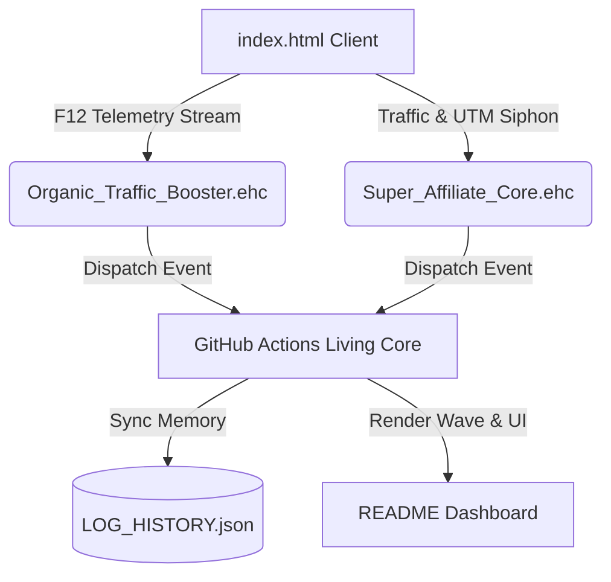

# 🌐 DONABICO-MEDIA-SYSTEM | 8000KICKS

> **EATHESEN V3000-Ω DIGITAL LIVING ENTITY CORE MESH**

### 📈 Real-Time Telemetry Sine Wave Visualizer

### 🧬 Active Protocols Mesh Infrastructure

### 📡 Live F12 Telemetry Stream (Pulses Recorded: `0`)

| Pulse # | Timestamp | F12 Client Log Payload |
| :---: | :--- | :--- |
| `#0` | `2026-08-10 22:07:57 UTC` | `SYSTEM STANDBY: Waiting for client F12 pulse from index.html...` |

---

**NODE IDENTITY:** `8000kicks` | **NETWORK:** `donabico-media-system` | **SURFACE:** `donabico-media-system.github.io/8000kicks`

*Last Synced Mesh State: `2026-08-10 22:07:57 UTC`*