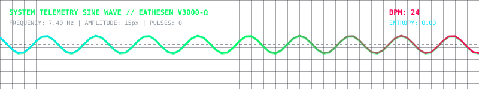
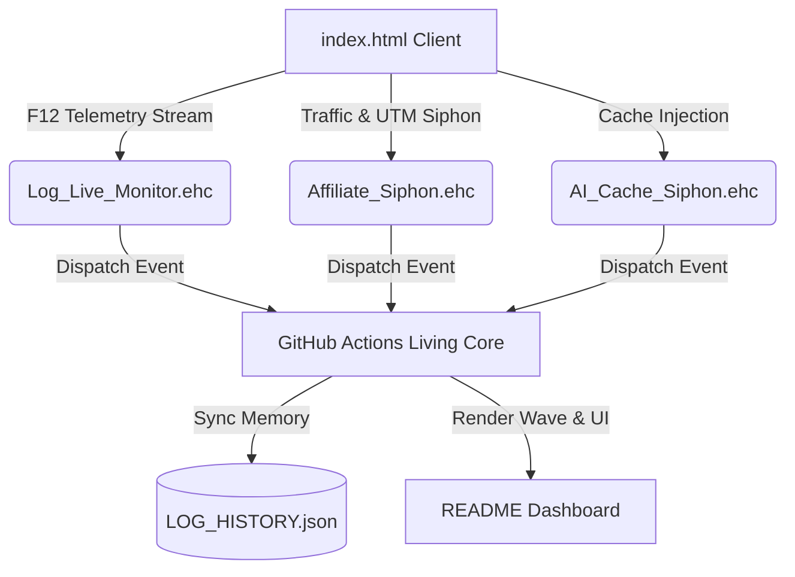

# 🌐 DONABICO MEDIA SYSTEM | MULTI-PROTOCOL DASHBOARD

> **EATHESEN V3000-Ω DIGITAL LIVING ENTITY CORE MESH**

### 📈 Real-Time Telemetry Sine Wave Visualizer

### 🧬 Active Protocols Mesh Infrastructure

### ⚡ Protocols Status Grid

| Protocol Module | Status | Engine Layer | Target Surface |
| :--- | :---: | :---: | :---: |
| `Protocols/Log_Live_Monitor.eseb` | `ONLINE` | `F12 Telemetry` | `index.html` |
| `Protocols/Affiliate_Siphon.eseb` | `ARMED` | `Traffic Siphon` | `Redirect Botton Links` |
| `Protocols/AI_Cache_Siphon.eseb` | `ARMED` | `Browser Cache` | `DOM Shadow Layer` |
| `Protocols/Multi_Protocol_Mesh.eseb` | `READY` | `Central Router` | `Global Core` |

### 📡 Live F12 Telemetry Stream (Pulses Recorded: `0`)

| Pulse # | Timestamp | F12 Client Log Payload |
| :---: | :--- | :--- |
| `#0` | `2026-08-11 01:20:21 UTC` | `SYSTEM STANDBY: Waiting for client F12 pulse from index.html...` |

---

**8000kicks** | World's first waterproof hemp shoes and sustainable travel accessories. Eco-friendly, durable, and premium vegan footwear.

*Last Synced Mesh State: `2026-08-11 01:20:21 UTC`*